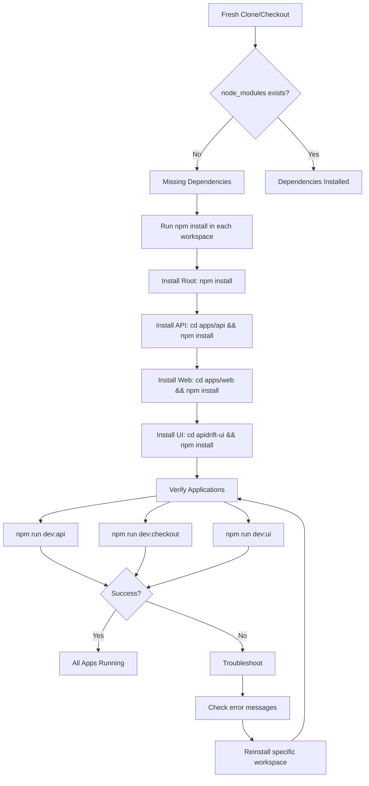

# Monorepo Dependency Installation Plan

## Visual Overview



## Root Cause Analysis

Your monorepo has **missing `node_modules` directories** in all workspaces. The errors you're seeing:

- `'ts-node' is not recognized` in [`apps/api`](apidrift/apps/api)
- `'next' is not recognized` in [`apps/web`](apidrift/apps/web) and [`apidrift-ui`](apidrift/apidrift-ui)

These occur because **npm dependencies have not been installed** in each workspace. This is a standard monorepo setup where each package manages its own dependencies independently.

### Why This Happens

1. **Independent Workspaces**: Your monorepo uses a simple multi-package structure where each app ([`apps/api`](apidrift/apps/api/package.json), [`apps/web`](apidrift/apps/web/package.json), [`apidrift-ui`](apidrift/apidrift-ui/package.json)) has its own [`package.json`](apidrift/package.json) and requires separate `npm install`
2. **No Workspace Manager**: Unlike npm workspaces or yarn workspaces, your root [`package.json`](apidrift/package.json) doesn't use a `workspaces` field, so dependencies aren't hoisted or shared
3. **Fresh Clone/Checkout**: When cloning a repo, `node_modules` directories are excluded via [`.gitignore`](apidrift/.gitignore), requiring fresh installation

## Step-by-Step Installation Instructions

### Prerequisites

- Node.js installed (v18+ recommended)
- npm installed (comes with Node.js)
- PowerShell terminal open in the project root

### Installation Steps

Execute these commands **in order** from the `apidrift` directory:

```powershell
# Step 1: Install root dependencies (for concurrently)
npm install

# Step 2: Install API dependencies
cd apps/api
npm install
cd ../..

# Step 3: Install Web app dependencies
cd apps/web
npm install
cd ../..

# Step 4: Install UI app dependencies
cd apidrift-ui
npm install
cd ..
```

### Alternative: Automated Installation Script

**Option A: One-Line Command**
```powershell
npm install; cd apps/api; npm install; cd ../..; cd apps/web; npm install; cd ../..; cd apidrift-ui; npm install; cd ..
```

**Option B: Create a PowerShell Script**

Create a file named `setup.ps1` in the `apidrift` directory with this content:

```powershell
# APIDrift Monorepo Setup Script
# This script installs all dependencies for the monorepo

Write-Host "=== APIDrift Dependency Installation ===" -ForegroundColor Cyan
Write-Host ""

# Function to install dependencies in a directory
function Install-Dependencies {
    param([string]$Path, [string]$Name)
    
    Write-Host "Installing dependencies for $Name..." -ForegroundColor Yellow
    Push-Location $Path
    
    if (Test-Path "package.json") {
        npm install
        if ($LASTEXITCODE -eq 0) {
            Write-Host "✓ $Name dependencies installed successfully" -ForegroundColor Green
        } else {
            Write-Host "✗ Failed to install $Name dependencies" -ForegroundColor Red
            Pop-Location
            exit 1
        }
    } else {
        Write-Host "✗ No package.json found in $Path" -ForegroundColor Red
        Pop-Location
        exit 1
    }
    
    Pop-Location
    Write-Host ""
}

# Install root dependencies
Install-Dependencies "." "Root"

# Install API dependencies
Install-Dependencies "apps/api" "API"

# Install Web app dependencies
Install-Dependencies "apps/web" "Web App"

# Install UI app dependencies
Install-Dependencies "apidrift-ui" "UI App"

Write-Host "=== Installation Complete ===" -ForegroundColor Cyan
Write-Host ""
Write-Host "You can now run the applications:" -ForegroundColor White
Write-Host "  - API:     cd apps/api && npm run dev" -ForegroundColor Gray
Write-Host "  - Web:     cd apps/web && npm run dev" -ForegroundColor Gray
Write-Host "  - UI:      cd apidrift-ui && npm run dev" -ForegroundColor Gray
Write-Host "  - All:     npm run dev:all" -ForegroundColor Gray
Write-Host ""
```

Then run it:
```powershell
.\setup.ps1
```

If you get an execution policy error, run:
```powershell
Set-ExecutionPolicy -ExecutionPolicy RemoteSigned -Scope CurrentUser
.\setup.ps1
```

## Verification Steps

After installation, verify each application can start:

### 1. Verify API Server

```powershell
cd apps/api
npm run dev
```

**Expected**: Server starts on a port (check console output)
**Press Ctrl+C to stop**

### 2. Verify Web App

```powershell
cd apps/web
npm run dev
```

**Expected**: Next.js dev server starts on http://localhost:3000
**Press Ctrl+C to stop**

### 3. Verify UI App

```powershell
cd apidrift-ui
npm run dev
```

**Expected**: Next.js dev server starts on http://localhost:3002
**Press Ctrl+C to stop**

### 4. Run All Apps Simultaneously (Optional)

From the root `apidrift` directory:

```powershell
npm run dev:all
```

**Expected**: All three apps start concurrently
**Press Ctrl+C to stop all**

## What Gets Installed

### Root (`apidrift/`)

- `concurrently` - Runs multiple npm scripts simultaneously

### API (`apps/api/`)

**Dependencies:**

- `express` - Web framework
- `cors` - CORS middleware

**Dev Dependencies:**

- `ts-node` - TypeScript execution (fixes your error)
- `typescript` - TypeScript compiler
- `jest`, `ts-jest` - Testing framework
- Type definitions for Node, Express, Jest

### Web App (`apps/web/`)

**Dependencies:**

- `next` - Next.js framework (fixes your error)
- `react`, `react-dom` - React library

**Dev Dependencies:**

- `typescript` - TypeScript compiler
- `tailwindcss`, `postcss`, `autoprefixer` - CSS framework
- Type definitions for Node, React

### UI App (`apidrift-ui/`)

**Dependencies:**

- `next` - Next.js framework (fixes your error)
- `react`, `react-dom` - React library
- `react-syntax-highlighter` - Code highlighting

**Dev Dependencies:**

- `typescript` - TypeScript compiler
- `tailwindcss`, `postcss`, `autoprefixer` - CSS framework
- Type definitions for Node, React, syntax highlighter

## Prevention Strategies

### 1. Document Installation in README

Add installation instructions to [`README.md`](apidrift/README.md) so team members know to run `npm install` in each workspace.

### 2. Consider Workspace Management

For better dependency management, consider migrating to npm workspaces by updating root [`package.json`](apidrift/package.json):

```json
{
  "name": "apidrift",
  "private": true,
  "workspaces": ["apps/*", "apidrift-ui"]
}
```

Then run `npm install` once from root to install all workspace dependencies.

### 3. Add Setup Script

Add a setup script to root [`package.json`](apidrift/package.json):

```json
"scripts": {
  "setup": "npm install && cd apps/api && npm install && cd ../web && npm install && cd ../../apidrift-ui && npm install"
}
```

Then new developers can run: `npm run setup`

### 4. Use CI/CD Checks

Add GitHub Actions or similar CI to verify all packages install successfully on every commit.

### 5. Pre-commit Hooks

Use husky to ensure `node_modules` exists before allowing commits that modify package files.

## Troubleshooting

### Issue: "npm install" fails with permission errors

**Solution**: Run PowerShell as Administrator or check file permissions

### Issue: "ENOENT: no such file or directory"

**Solution**: Ensure you're in the correct directory before running `npm install`

### Issue: Version conflicts or peer dependency warnings

**Solution**: These are usually safe to ignore, but you can run `npm install --legacy-peer-deps` if needed

### Issue: Apps still won't start after installation

**Solution**:

1. Delete `node_modules` and `package-lock.json` in the affected workspace
2. Run `npm install` again
3. Check for port conflicts (3000, 3002) if apps fail to start

### Issue: "Cannot find module" errors

**Solution**: Verify `node_modules` directory exists in the workspace where you're running the command

## Summary

Your issue is straightforward: **dependencies were never installed**. The solution is to run `npm install` in each of the four directories (root, apps/api, apps/web, apidrift-ui). This is a one-time setup step required after cloning the repository or when [`package.json`](apidrift/package.json) files are updated.

After following the installation steps above, all three applications should run successfully without the "command not recognized" errors.
